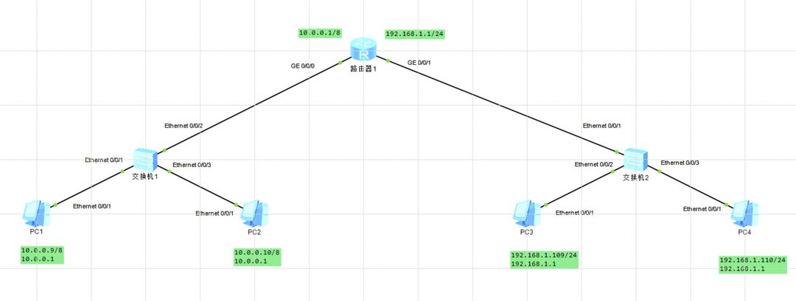

# net-test

作用：将两个子网通过路由器进行组网。

拓扑图



打开`net-test.topo`，启动所有设备。

路由器设备启动会略慢。直到等到连线上面所有点都变成绿色，表示网络已通。

右键`路由器1`-`CLI`，按照如下顺序输入命令。

```sh
The device is running!

<Huawei>sys
Enter system view, return user view with Ctrl+Z.

[Huawei]in g 0/0/0

[Huawei-GigabitEthernet0/0/0]ip address 10.0.0.1 255.0.0.0
Mar 30 2025 15:27:30-08:00 Huawei %%01IFNET/4/LINK_STATE(l)[0]:The line protocol
 IP on the interface GigabitEthernet0/0/0 has entered the UP state. 
 
[Huawei-GigabitEthernet0/0/0]q

[Huawei]in g 0/0/1

[Huawei-GigabitEthernet0/0/1]ip address 192.168.1.1 255.255.255.0
Mar 30 2025 15:27:46-08:00 Huawei %%01IFNET/4/LINK_STATE(l)[1]:The line protocol
 IP on the interface GigabitEthernet0/0/1 has entered the UP state. 
 
[Huawei-GigabitEthernet0/0/1]q

[Huawei]dis ip in b
*down: administratively down
^down: standby
(l): loopback
(s): spoofing
The number of interface that is UP in Physical is 3
The number of interface that is DOWN in Physical is 1
The number of interface that is UP in Protocol is 3
The number of interface that is DOWN in Protocol is 1

Interface                         IP Address/Mask      Physical   Protocol  
GigabitEthernet0/0/0              10.0.0.1/8           up         up        
GigabitEthernet0/0/1              192.168.1.1/24       up         up        
GigabitEthernet0/0/2              unassigned           down       down      
NULL0                             unassigned           up         up(s)   
```

通过 `192.168.1.100` 去`ping 10.0.0.10`，能连通，表示组网成功